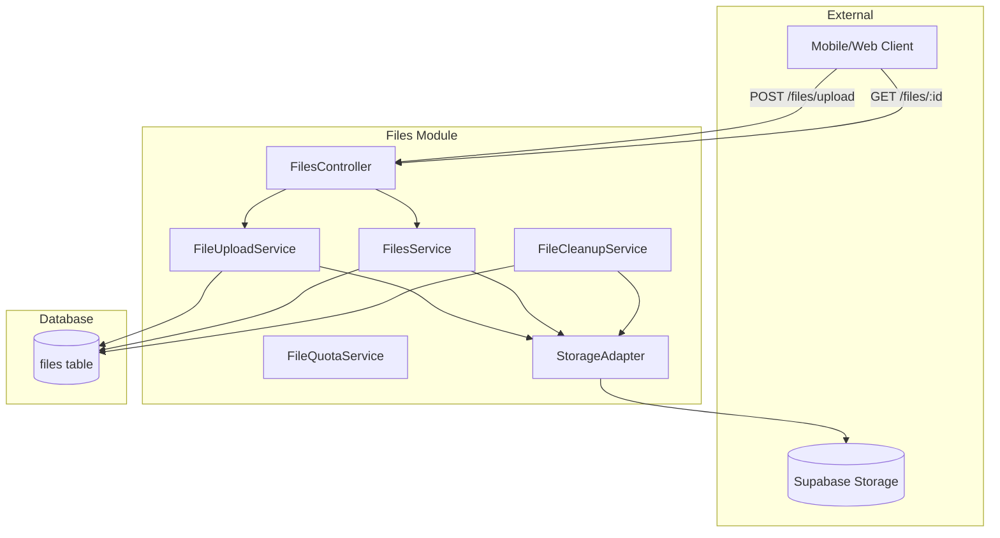
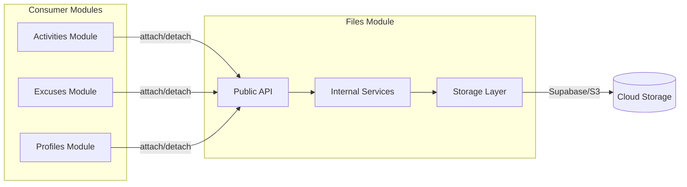
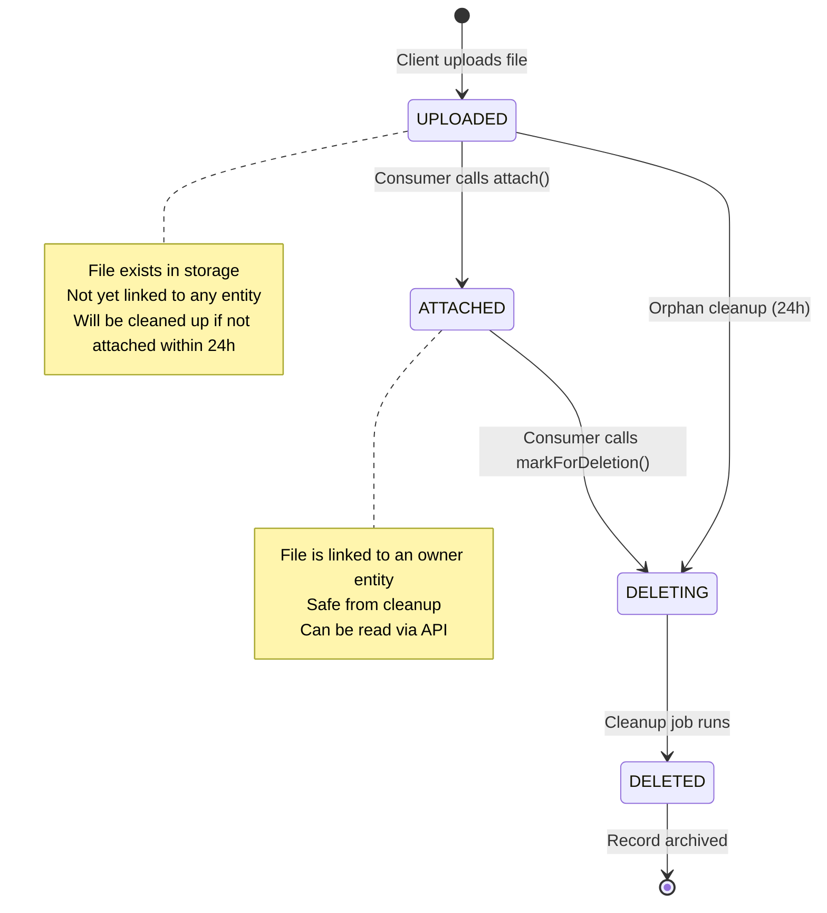
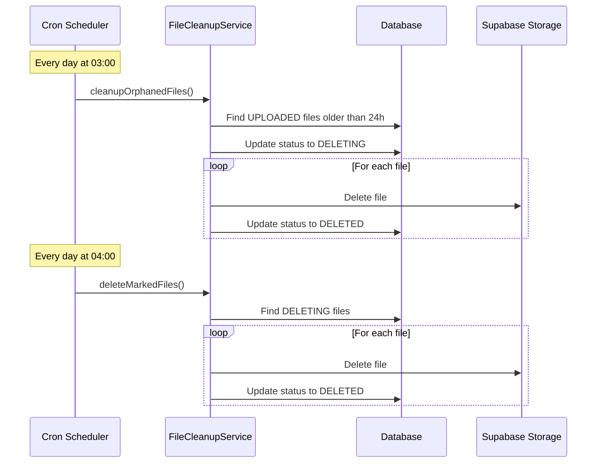
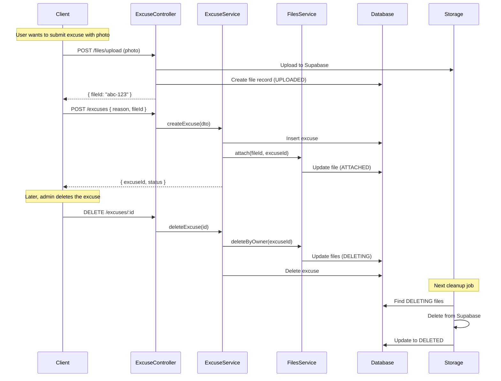

# 📁 Files Module - Developer Documentation

> **Version:** 1.0.0  
> **Last Updated:** 2026-01-25  
> **Status:** Production Ready (Auth Guard pending)

---

## 📋 Table of Contents

1. [Overview](#overview)
2. [Architecture](#architecture)
3. [File Lifecycle](#file-lifecycle)
4. [Module Structure](#module-structure)
5. [Core Services](#core-services)
6. [Storage Adapters](#storage-adapters)
7. [Integration Guide](#integration-guide)
8. [API Reference](#api-reference)
9. [Configuration](#configuration)
10. [Error Handling](#error-handling)
11. [Best Practices](#best-practices)

---

## Overview

Files Module, HavkApp backend'inde dosya yönetimi için merkezi bir altyapı sağlar. Bu modül:

- **Multi-tenant isolation**: Her dosya bir Club'a bağlıdır
- **Pluggable storage**: Supabase, S3, Local desteği
- **Automatic cleanup**: Orphan dosyalar otomatik temizlenir
- **Type-safe contracts**: Discriminated union ile güvenli tipler
- **Stream-based**: Büyük dosyalar için memory-efficient



---

## Architecture

### High-Level Architecture



### Design Principles

| Principle | Implementation |
|-----------|----------------|
| **Single Responsibility** | Her service tek bir iş yapar |
| **Dependency Inversion** | Storage adapter interface üzerinden |
| **Open/Closed** | Yeni storage provider eklemek kolay |
| **Multi-tenancy** | ClubId ile izolasyon |

---

## File Lifecycle

Bir dosyanın yaşam döngüsü 4 durumdan oluşur:



### Status Descriptions

| Status | Description | Readable | Deletable |
|--------|-------------|----------|-----------|
| `UPLOADED` | Yeni yüklendi, henüz bağlanmadı | ❌ | ✅ (24h sonra) |
| `ATTACHED` | Bir entity'ye bağlı, aktif kullanımda | ✅ | ❌ |
| `DELETING` | Silinmek üzere işaretlendi | ❌ | ✅ |
| `DELETED` | Storage'dan silindi, kayıt arşivlendi | ❌ | ❌ |

---

## Module Structure

```
src/files/
├── entities/
│   └── file.entity.ts          # TypeORM entity
├── services/
│   ├── file-upload.service.ts  # Upload logic (MIME, quota, checksum)
│   ├── files.service.ts        # CRUD operations (attach, detach, read)
│   ├── file-cleanup.service.ts # Cron-based cleanup jobs
│   ├── file-quota.service.ts   # Storage quota management
│   └── file-processing.service.ts # Image processing (optional)
├── storage/
│   ├── storage-adapter.interface.ts  # Abstract interface
│   ├── storage.constants.ts          # DI token
│   └── adapters/
│       └── supabase.adapter.ts       # Supabase implementation
├── files.contract.ts           # Shared types and enums
├── files.controller.ts         # HTTP endpoints
└── files.module.ts             # NestJS module
```

---

## Core Services

### 1. FileUploadService

Dosya yükleme işlemlerini yönetir.

```typescript
// Örnek kullanım (internal)
const result = await this.uploadService.upload({
  clubId: 'uuid',
  stream: Readable.from(buffer),
  originalName: 'photo.jpg',
  declaredMimeType: 'image/jpeg',
  size: 1024000,
});

// Dönen değer
interface UploadResult {
  fileId: string;      // UUID
  checksum: string;    // SHA-256 hash
  size: number;        // Actual bytes
  mimeType: string;    // Detected MIME type
}
```

**Features:**
- ✅ Magic byte MIME detection (file-type library)
- ✅ SHA-256 checksum calculation
- ✅ Stream/Buffer hybrid strategy (10MB threshold)
- ✅ Quota check before upload
- ✅ Allowed MIME types validation

---

### 2. FilesService

Dosya CRUD operasyonlarını yönetir. **Diğer modüller bu service'i kullanır.**

```typescript
// Module'ünüzde inject edin
constructor(
  private readonly filesService: FilesService,
) {}
```

#### `attach()` - Dosyayı bir entity'ye bağla

```typescript
// Bir excuse'a dosya bağlama örneği
const file = await this.filesService.attach(
  fileId,           // Upload'dan dönen UUID
  clubId,           // Club context
  excuseId,         // Owner entity ID
  FileOwnerType.EXCUSE,  // Owner type enum
);
```

#### `read()` - Dosya içeriğini oku

```typescript
const result = await this.filesService.read({
  fileId: 'uuid',
  clubId: 'uuid',
  canRead: true,           // Permission check result
  preferRedirect: false,   // true = signed URL, false = stream
});

// Discriminated Union - TypeScript type narrowing
if (result.mode === 'redirect') {
  // result.redirectUrl is guaranteed to exist
  return res.redirect(result.redirectUrl);
}

// result.mode === 'stream'
// result.stream is guaranteed to exist
return new StreamableFile(result.stream);
```

#### `detach()` - Dosya bağlantısını kaldır

```typescript
await this.filesService.detach(fileId, clubId);
// File returns to UPLOADED status
// Will be cleaned up after 24h if not re-attached
```

#### `markForDeletion()` - Dosyayı silmek için işaretle

```typescript
await this.filesService.markForDeletion(fileId, clubId);
// File status → DELETING
// Will be deleted from storage in next cleanup job
```

#### `deleteByOwner()` - Owner'a ait tüm dosyaları sil

```typescript
// Bir excuse silindiğinde, tüm dosyalarını da sil
const count = await this.filesService.deleteByOwner(
  clubId,
  excuseId,
  FileOwnerType.EXCUSE,
);
console.log(`${count} files marked for deletion`);
```

#### `findByOwner()` - Owner'a ait dosyaları listele

```typescript
const files = await this.filesService.findByOwner(
  clubId,
  userId,
  FileOwnerType.PROFILE,
);
```

---

### 3. FileCleanupService

Otomatik temizlik işlerini yönetir (Cron jobs).



**Jobs:**

| Job | Schedule | Description |
|-----|----------|-------------|
| `cleanupOrphanedFiles` | 03:00 daily | UPLOADED + 24h old → Delete |
| `deleteMarkedFiles` | 04:00 daily | DELETING → Delete from storage |

---

## Storage Adapters

### Interface

```typescript
interface StorageAdapter {
  get(key: string, bucket?: string): Promise<StorageGetResult>;
  put(stream: Readable, key: string, options: PutOptions): Promise<StoragePutResult>;
  delete(key: string, bucket?: string): Promise<void>;
  exists(key: string, bucket?: string): Promise<boolean>;
  getRedirectUrl?(key: string, bucket?: string, options?: RedirectOptions): Promise<string | null>;
}
```

### Supported Providers

| Provider | Status | Notes |
|----------|--------|-------|
| **Supabase** | ✅ Active | Production kullanımda |
| **S3** | ⏳ Planned | Aynı interface, farklı implementation |
| **Local** | ⏳ Planned | Development için |

### Adding a New Provider

```typescript
// 1. Create adapter
@Injectable()
export class S3StorageAdapter implements StorageAdapter {
  // Implement all methods
}

// 2. Register in module factory
switch (provider) {
  case 'supabase':
    return new SupabaseStorageAdapter(configService);
  case 's3':
    return new S3StorageAdapter(configService);  // Add this
}
```

---

## Integration Guide

### Step 1: Import FilesModule

```typescript
// excuses.module.ts
import { Module } from '@nestjs/common';
import { FilesModule } from '../files/files.module';

@Module({
  imports: [FilesModule],  // Import the module
  // ...
})
export class ExcusesModule {}
```

### Step 2: Inject FilesService

```typescript
// excuses.service.ts
import { FilesService } from '../files/services/files.service';
import { FileOwnerType } from '../files/files.contract';

@Injectable()
export class ExcusesService {
  constructor(
    private readonly filesService: FilesService,
  ) {}
}
```

### Step 3: Use in Your Business Logic

```typescript
// excuses.service.ts

async createExcuse(dto: CreateExcuseDto, clubId: string) {
  // 1. Create excuse entity
  const excuse = await this.excusesRepo.save({
    clubId,
    reason: dto.reason,
    // ...
  });
  
  // 2. Attach file if provided
  if (dto.fileId) {
    await this.filesService.attach(
      dto.fileId,
      clubId,
      excuse.id,
      FileOwnerType.EXCUSE,
    );
  }
  
  return excuse;
}

async deleteExcuse(excuseId: string, clubId: string) {
  // 1. Mark all files for deletion
  await this.filesService.deleteByOwner(
    clubId,
    excuseId,
    FileOwnerType.EXCUSE,
  );
  
  // 2. Delete excuse
  await this.excusesRepo.delete({ id: excuseId, clubId });
}
```

### Complete Integration Example



---

## API Reference

### Endpoints

| Method | Path | Description | Auth |
|--------|------|-------------|------|
| `POST` | `/files/upload` | Upload a file | Required |
| `GET` | `/files/:id` | Download/stream a file | Required |
| `GET` | `/files/health/check` | Health check | None |

### POST /files/upload

**Request:**
```http
POST /files/upload HTTP/1.1
Content-Type: multipart/form-data
x-club-id: <club-uuid>

file: <binary>
```

**Response:**
```json
{
  "fileId": "63a16a4d-db87-4ad3-a59a-82383451a62e",
  "checksum": "f70310abcbd50215ce2468f857b23649...",
  "size": 1024000,
  "mimeType": "image/jpeg"
}
```

### GET /files/:id

**Request:**
```http
GET /files/63a16a4d-db87-4ad3-a59a-82383451a62e HTTP/1.1
x-club-id: <club-uuid>
```

**Query Parameters:**
- `redirect=true`: Return 307 redirect to signed URL instead of streaming

**Response (stream):**
- Binary file content
- Headers: `Content-Type`, `Content-Length`, `Cache-Control`

**Response (redirect):**
- 307 Temporary Redirect to Supabase signed URL

---

## Configuration

### Environment Variables

| Variable | Default | Description |
|----------|---------|-------------|
| `STORAGE_PROVIDER` | `local` | Storage backend: `supabase`, `s3`, `local` |
| `SUPABASE_URL` | - | Supabase project URL |
| `SUPABASE_SERVICE_ROLE_KEY` | - | Supabase service role key |
| `SUPABASE_STORAGE_BUCKET` | `files` | Default bucket name |
| `FILE_UPLOAD_MAX_SIZE` | `52428800` | Max file size in bytes (50MB) |
| `FILE_STREAM_THRESHOLD` | `10485760` | Stream vs buffer threshold (10MB) |
| `ALLOWED_MIME_TYPES` | `image/*,application/pdf,text/plain` | Comma-separated MIME types |
| `ORPHAN_TTL_HOURS` | `24` | Hours before orphan files are deleted |
| `CLEANUP_BATCH_SIZE` | `100` | Files processed per cleanup batch |

### Example .env

```env
STORAGE_PROVIDER=supabase
SUPABASE_URL=https://xxx.supabase.co
SUPABASE_SERVICE_ROLE_KEY=eyJhbG...
SUPABASE_STORAGE_BUCKET=files

FILE_UPLOAD_MAX_SIZE=5242880
ALLOWED_MIME_TYPES=image/jpeg,image/png,image/gif,image/webp,application/pdf

ORPHAN_TTL_HOURS=24
CLEANUP_BATCH_SIZE=100
```

---

## Error Handling

### Common Errors

| Error | Status | Cause | Solution |
|-------|--------|-------|----------|
| `File size exceeds maximum` | 400 | File > `FILE_UPLOAD_MAX_SIZE` | Increase limit or compress file |
| `File type not allowed` | 400 | MIME type not in whitelist | Add to `ALLOWED_MIME_TYPES` |
| `File not found or not available` | 404 | File doesn't exist or not ATTACHED | Check fileId and status |
| `Access denied to file` | 403 | `canRead: false` | Check permissions |
| `Storage upload failed` | 500 | Supabase connection issue | Check credentials |

### Error Response Format

```json
{
  "statusCode": 400,
  "message": "File type \"application/exe\" is not allowed",
  "error": "Bad Request"
}
```

---

## Best Practices

### ✅ Do's

1. **Always attach files after upload**
   ```typescript
   // Bad: Upload and forget
   const { fileId } = await uploadFile();
   // File will be deleted after 24h!
   
   // Good: Upload and attach
   const { fileId } = await uploadFile();
   await filesService.attach(fileId, clubId, entityId, ownerType);
   ```

2. **Delete files when deleting parent entity**
   ```typescript
   async deleteEntity(id: string, clubId: string) {
     await this.filesService.deleteByOwner(clubId, id, ownerType);
     await this.entityRepo.delete(id);
   }
   ```

3. **Use preferRedirect for large files**
   ```typescript
   // Better performance for large files
   const result = await filesService.read({
     fileId, clubId, canRead: true,
     preferRedirect: true,  // Returns signed URL
   });
   ```

### ❌ Don'ts

1. **Don't store file content in database**
   ```typescript
   // Bad
   entity.fileContent = buffer;
   
   // Good
   entity.fileId = uploadResult.fileId;
   ```

2. **Don't bypass FilesService**
   ```typescript
   // Bad: Direct storage access
   await storage.delete(key);
   
   // Good: Use service
   await filesService.markForDeletion(fileId, clubId);
   ```

3. **Don't forget clubId**
   ```typescript
   // Bad: No tenant isolation
   await filesService.attach(fileId, null, entityId, type);
   
   // Good: Always include clubId
   await filesService.attach(fileId, clubId, entityId, type);
   ```

---

## Appendix

### FileEntity Schema

```typescript
@Entity('files')
class FileEntity {
  @PrimaryGeneratedColumn('uuid')
  id: string;

  @Column({ type: 'uuid' })
  clubId: string;

  @Column({ length: 500 })
  originalName: string;

  @Column({ length: 100 })
  mimeType: string;

  @Column({ length: 100 })
  detectedMimeType: string;

  @Column({ type: 'bigint' })
  size: number;

  @Column({ length: 64 })
  checksum: string;

  @Column({ unique: true })
  storageKey: string;

  @Column({ type: 'enum', enum: StorageProvider })
  storageProvider: StorageProvider;

  @Column({ nullable: true })
  bucket?: string;

  @Column({ type: 'enum', enum: FileOwnerType, nullable: true })
  ownerType?: FileOwnerType;

  @Column({ nullable: true })
  ownerId?: string;

  @Column({ type: 'enum', enum: FileStatus })
  status: FileStatus;

  @CreateDateColumn()
  createdAt: Date;

  @UpdateDateColumn()
  updatedAt: Date;

  @Column({ nullable: true })
  attachedAt?: Date;

  @Column({ nullable: true })
  deletedAt?: Date;

  @Column({ type: 'jsonb', nullable: true })
  metadata?: Record<string, any>;
}
```

### Adding New FileOwnerType

```typescript
// 1. Add to enum in files.contract.ts
export enum FileOwnerType {
  EXCUSE = 'EXCUSE',
  PROFILE = 'PROFILE',
  DOCUMENT = 'DOCUMENT',
  ACTIVITY_COVER = 'ACTIVITY_COVER',  // New type
}

// 2. Use in your module
await filesService.attach(fileId, clubId, activityId, FileOwnerType.ACTIVITY_COVER);
```

---

> **Questions?** Contact the backend team or check the source code in `src/files/`.
